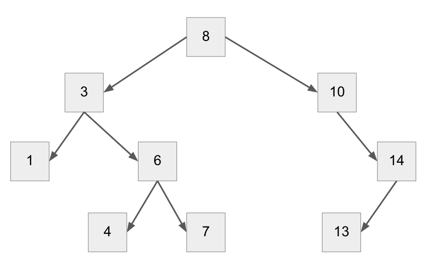

# The Tree Data Structure
## Introduction
Trees are a data structure type that is similar to linked lists, but each node points to two children, instead of one. This creates a tree-like structure, with each branch growing as more data is added.

The main advantage of trees is the ability to easily add new nodes, and search through nodes effectively.

### What does a tree look like?
Here is what a tree looks like. This image will be referenced in the coming sections.


Figure 1

### How are Binary Trees Organized?
The best way to describe how binary trees are organized is to walk through the process of adding a node to the tree. Let's say we start with the figure above, and we would like to add the number 5 to the tree. 
1. We would start at the root of the tree, and decide, is 5 larger or smaller than 8. If it is larger, we will move to the right, and if it is smaller, we will move to the left. In our case, 5 is smaller than 13, so we will traverse to the left. 
2. We are now to the number 3. We would go to the right since 5 is larger than 3, and now we are on 6. 
3. We know that 6 is larger than 5, so we would go to the left. 
4. We are now at the end of the tree, with node 4. This is where we will assign our new node, number 5. We know that 5 is larger than 4, so we will add the new node to the right of 4. 

There you have it! This is how nodes are added to trees. The process of searching through a tree is the same, but instead of adding a new value, you would be looking for a value.

### Binary Tree vs Non-binary Tree
A tree is considered binary when each node points to two nodes. A Non-Binary tree is when each node points to more than one node, creating a much wider and vast tree.

### Balanced vs. Unbalanced Trees
When there are more nodes on one half of the tree than the other, this is what is considered an unbalanced tree. It is best practice to ensure that the trees are as balanced as possible in order to efficiently use a tree.

When a tree is balanced, it carries the most advantages of efficiency and speed when searching through it.

### How does Recursion come into play?
Trees are what is considered a "recursive data structure". This means that when working with trees in Python, recursion will often be used to traverse the data. For example, in the steps of adding a new node to the tree, recursion is used to call a comparison on the next node. So, if we saw that the node we are comparing against is greater than the value we would like to add, we would use recursion to check again, but to see if it is smaller.

## Sections of a Tree
#### Node
A tree is made up of many nodes. A node is a piece of data that points to other pieces of data. In the case of a binary tree, each node will potentially point to two other nodes. Each square in figure 1 is considered a node.
#### Root
The root is the first item in the tree. In figure 1, node 8 is the root. When searching through a tree, the root will be where the search starts at.
#### Parent
The parent is any node that is pointing to other nodes. For example, node 6 is a parent to nodes 4 and 7 in figure 1.
#### Child
A child node is any node that has other nodes pointing to it. Using figure 1, we can see that node 6 is a child of node 3.
#### Leaf
A leaf node is a node that doesn't point to anything else. Nodes 1, 4 7, and 13 are all leaves.


## Code Example - Creating a Binary Search Tree
Below is a code example of creating a Binary Search Tree, and how to add nodes to the tree.

```
class Node:
    def __init__(self, value=None):
        self.left = None
        self.right = None
        self.value = value
        
    def insert(self, value):
        
        if not self.value:
            self.value = value
            return

        if self.value == value:
            return

        if value < self.value:
            if self.left:
                self.left.insert(value)
                return
            self.left = Node(value)
            return

        if self.right:
            self.right.insert(value)
            return
        self.right = Node(value)
```


## Problem for You to Solve!

Using the code from above, create a function that removes a node from the Binary Search Tree.

[Link to the solution](tree_code_solution.py)
