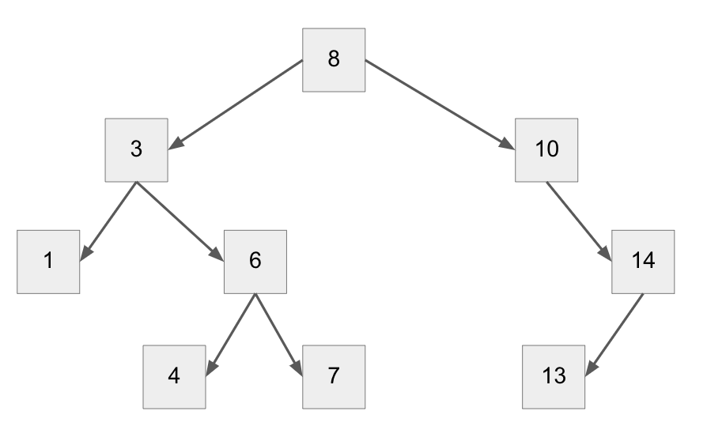

# The Tree Data Structure
## Introduction
Trees are a data structure type that are similar to linked lists, but each node points to two children, instead of one. This creates a tree-like structure, with each branch growing as more data is added.

The main advantage of trees is the ability to easily add new nodes, and search through nodes effectivley.

### What does a tree look like?
Here is what a tree looks like. This image will be referenced in the coming sections.

### Binary Tree vs Non-binary Tree
A tree is considered binary when each node points to two nodes. A Non-Binary tree is when each node points to more than one node, creating a much wider and vast tree.

### Balanced vs. Unbalanced Trees
When there are more nodes on one half of the tree than the other, this is what is considered an unbalanced tree. It is best practice to ensure that the trees are as balanced as possible in order to effeciently use a tree.

When a tree is balanced, it carries the most advantages of effeciency and speed when searching through it.

## Sections of a Tree
### Node
### Root
### Parent
### Child
### Leaf

### Searching Through A Binary Search Tree

## Tree Operations
### Adding to a Tree
### Removing from a Tree
### Finding the Size of a Tree
